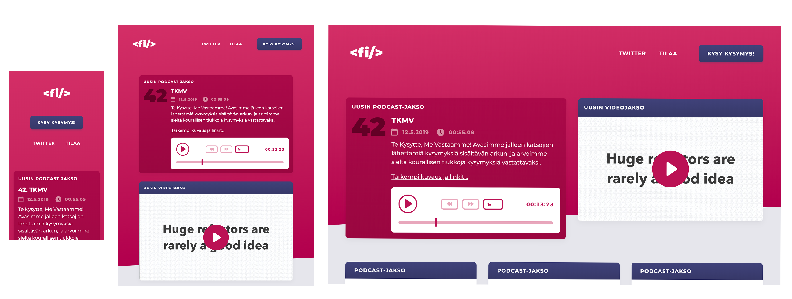
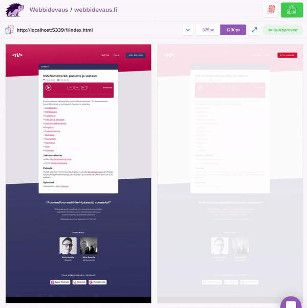

import { Appear, Image, Notes } from "mdx-deck";
import { syntaxHighlighterPrism } from "@mdx-deck/themes";
import { future } from "@mdx-deck/themes";
import { Invert } from "mdx-deck/layouts";
import WithBgImage from "./components/WithBgImage";
export const themes = [syntaxHighlighterPrism, future];

# Webbidevaus.fi

## CSSNuggets™ 8 kpl

---

<Image src="images/nuggets.jpg" />

---

<!-- Antti -->

## Nugget 1

# font-display

---

```css
@font-face {
  font-family: "my-font";
  src: url(my-font.woff2) format("woff2");
}
```

<Notes>
  This is more or less how you traditionally load a web font: Specify name and
  source.
</Notes>

---

# FOUT & FOIT

<Appear>
  <div>Flash of Unstyled Text</div>
  <div> Flash of Invisible Text</div>
</Appear>

---

# font-display

<ul>
  <Appear>
    <li>block</li>
    <li>swap</li>
    <li>fallback</li>
    <li>optional</li>
  </Appear>
</ul>

<Notes>
  <ul>
    <li>Block: Invisible for 3 secs, then fallback</li>
    <li>Swap: Fallback immediately, custom font swapped</li>
    <li>Fallback: Invisible for 100ms, then fallback</li>
    <li>
      Optional: Like fallback, but browser can choose not to show web font at
      all
    </li>
  </ul>
</Notes>

---


<p><a href="https://font-display.glitch.me/">https://font-display.glitch.me/</a></p>

<Notes>
  <ul>
    <li>Block: Invisible for 3 secs, then fallback</li>
    <li>Swap: Fallback immediately, custom font swapped</li>
    <li>Fallback: Invisible for 100ms, then fallback</li>
    <li>
      Optional: Like fallback, but browser can choose not to show web font at
      all
    </li>
  </ul>
  <p>This is great. I use Google Fonts. What can I do?</p>
</Notes>

---

# Google Fonts <3 font-display

<Notes>Google Fonts just rolled out support for font-display!</Notes>

---


<p><a href="https://twitter.com/addyosmani/status/1128548064287952896">https://twitter.com/addyosmani/status/1128548064287952896</a></p>

<Notes>Just add a query parameter with the wanted font-display value.</Notes>

---

```css
@font-face {
  font-family: "Roboto";
  font-display: swap;
  src: url(https://fonts...) format("woff2");
}
```

---

<!-- Riku -->

## Nugget 2


Use <span style={{
  "background":"url(images/nuggets2.png)",
  "color":"transparent",
  "backgroundSize": "200%",
  "backgroundPosition": "40%",
  "WebkitBackgroundClip":"text"
}}>anything</span> as your text background

```css
background-clip: text;
```

---

<span style={{
  "margin":"0",
  "backgroundRepeat": "no-repeat",
  "fontSize":"300px",
  "fontWeight": "bold",
  "background":"url(https://media.giphy.com/media/l2Sqf1Y2g9C3F97kA/giphy.gif)",
  "color":"#fff"
}}>HELLO</span>

```css
span {
  background: url(party.gif);
}
```

<Notes>
Apply a background colour / image / gradient to element containing text
</Notes>

---

<span style={{
  "margin":"0",
  "backgroundRepeat": "no-repeat",
  "fontSize":"300px",
  "fontWeight": "bold",
  "background":"url(https://media.giphy.com/media/l2Sqf1Y2g9C3F97kA/giphy.gif)",
  "color":"transparent",
  "WebkitBackgroundClip":"text"
}}>HELLO</span>


```css
span {
  background: url(party.gif);
  -webkit-background-clip: text;
  color: transparent;
}
```
---

<iframe style={{ width: "100vw", height: "100vh" }} scrolling="no" title="zQdrzP" src="//codepen.io/rikukissa/embed/zQdrzP/?height=265&theme-id=0&default-tab=css,result" frameborder="no" allowtransparency="true" allowfullscreen="true">
  See the Pen <a href='https://codepen.io/rikukissa/pen/zQdrzP/'>zQdrzP</a> by Riku Rouvila
  (<a href='https://codepen.io/rikukissa'>@rikukissa</a>) on <a href='https://codepen.io'>CodePen</a>.
</iframe>


---

### Also works with emojis 🤩

# 🔥💘🎉🍆🎙🤷‍

---

### Also works with emojis 🤩

<h1 style={{
  "background":"url(https://media.giphy.com/media/SKGo6OYe24EBG/giphy.gif)",
  "backgroundSize": "100px",
  "backgroundPosition": "-30px -125px",
  "color":"transparent",
  "WebkitBackgroundClip":"text"
}}>🔥💘🎉🍆🎙🤷‍</h1>

---

<!-- Riku -->

## Nugget 3

### INSERT SUMMARY HERE

---

Start with the smallest device size 📱


<Notes>
  All devtools support mobile mode already
</Notes>

---

<Invert>
  <Image size="contain" src="images/mobile.png" />
</Invert>

<Notes>
  It's way easier to work this way. Practical reasons
</Notes>

---

# CSS Mobile device detection kinda sucks 😓

```css
@media only screen
and (min-device-width: 375px)
and (max-device-width: 667px)
and (-webkit-min-device-pixel-ratio: 2)
and (orientation: portrait) {
  /* Probably an iPhone in portrait mode */
}
```

---

"... device landscape is slowly blurring the lines between what things are and aren't touch devices"

<Notes>
  iPad Pros are touch-only with the resolution of a 13" laptop
</Notes>

---

# 🎉 Pointer media query

```css
@media (pointer:coarse) {
  /* CSS rules for touch screen */
}
@media (hover) {
  /* CSS rules for devices that have hover support */
}
```

<Notes>
How about devices that have both pointers?
</Notes>

---

<Invert>
  

  Visual diffing with percy.io
</Invert>

---

### Nugget 4
# Grid

---

TBD Antti

---

### Nugget 5

# `gap` property with flexbox

---

<Invert>
  <Image size="contain" src="images/gap-1.png" />
</Invert>

---

<Invert>
  <Image size="contain" src="images/gap-2.png" />
</Invert>

---

<Invert>
  <Image size="contain" src="images/gap-3.png" />
</Invert>

---

```css
gap: 20px;
gap: 1em;
gap: 3vmin;

/* ... So */
gap: <'row-gap'> <'column-gap'>
```

---

### Nugget 6

# Margins. How do they work?

---

<iframe
  style={{ width: "100vw", height: "100vh" }}
  scrolling="no"
  title="Margin collapse"
  src="//codepen.io/anttti/embed/yWXZZZ/?height=265&theme-id=dark&default-tab=css,result"
  frameBorder="no"
>
  See the Pen{" "}
  <a href="https://codepen.io/anttti/pen/yWXZZZ/">Margin collapse</a> by Antti
  Mattila (<a href="https://codepen.io/anttti">@anttti</a>) on{" "}
  <a href="https://codepen.io">CodePen</a>.
</iframe>

<Notes>
  Margins collapse when two vertical margins come in contact with one another.
  If one margin is greater than the other, the bigger overrides the smaller (as
  usually happens in life).

Here are adjacent elements, but margin collapsing also happens with parent & first / last child:

</Notes>

---

<iframe
  style={{ width: "100vw", height: "100vh" }}
  scrolling="no"
  title="Margin collapse"
  src="//codepen.io/anttti/embed/dERaQX/?height=265&theme-id=dark&default-tab=css,result"
  frameBorder="no"
>
  See the Pen{" "}
  <a href="https://codepen.io/anttti/pen/dERaQX/">Margin collapse</a> by Antti
  Mattila (<a href="https://codepen.io/anttti">@anttti</a>) on{" "}
  <a href="https://codepen.io">CodePen</a>.
</iframe>

<Notes>
  Here's another example demonstrating how margin collapsing happens only on the
  vertical axis.
</Notes>

---

### Weird, huh?!


<Notes>
  <ul>
    <li>
      Margins of floating and absolutely positioned elements never collapse.
    </li>
    <li>
      If one margin is negative, the negative margin is subtracted from the
      positive margin.
    </li>
    <li>
      The general meaning of "margin" isn't to convey "move this over by 10px"
      but rather, "there must be 10px of empty space beside this element."
    </li>
  </ul>
</Notes>

---

### Nugget 7

# Top padding with percentages

---

<iframe style={{ width: "100vw", height: "100vh" }} scrolling="no" title="Mdvygr" src="//codepen.io/rikukissa/embed/Mdvygr/?height=265&theme-id=0&default-tab=css,result" frameborder="no" allowtransparency="true" allowfullscreen="true">
  See the Pen <a href='https://codepen.io/rikukissa/pen/Mdvygr/'>Mdvygr</a> by Riku Rouvila
  (<a href='https://codepen.io/rikukissa'>@rikukissa</a>) on <a href='https://codepen.io'>CodePen</a>.
</iframe>

---

### Use case
div with a background-image and a fixed aspect-ratio

---

<iframe style={{ width: "100vw", height: "100vh" }} scrolling="no" title="eaEZYr" src="//codepen.io/rikukissa/embed/eaEZYr/?height=265&theme-id=0&default-tab=css,result" frameborder="no" allowtransparency="true" allowfullscreen="true">
  See the Pen <a href='https://codepen.io/rikukissa/pen/eaEZYr/'>eaEZYr</a> by Riku Rouvila
  (<a href='https://codepen.io/rikukissa'>@rikukissa</a>) on <a href='https://codepen.io'>CodePen</a>.
</iframe>

---


# CSS TRouBLe?!

---

```css
.goose {
  margin-top: 0;
  margin-right: 2rem;
  margin-bottom: 1rem;
  margin-left: 1.5rem;
}
```

<Notes>
  You all know what this means, and probably that there's a shorthand way of
  writing this:
</Notes>

---

```css
.goose {
  margin: 0 2rem 1rem 1.5rem;
}
```

<Notes>
  But now it might be a bit tricky to remember the order. Luckily there's a
  clever rule:
</Notes>

---

```
T op
R ight
o
u
B ottom
L eft
e
```

---

```css
.jester {
  border-radius: 4px 8px 2px 6px;
}
```

<Notes>
  Works with border-radius too, but have to think corners instead of sides,
  starting from top left.
</Notes>

---

<Invert>
  <Image size="contain" src="images/clock.png" />
</Invert>

---

<Image src="images/thanks.jpg" />
