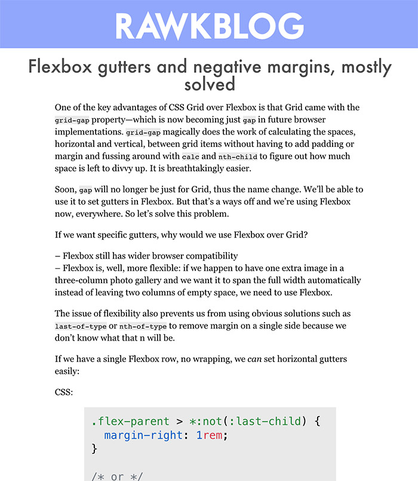

import { Appear, Head, Image, Notes } from "mdx-deck";
import { syntaxHighlighterPrism } from "@mdx-deck/themes";
import theme from "./theme";

import { Invert, SplitRight } from "mdx-deck/layouts";
import WithBgImage from "./components/WithBgImage";
import Flex from "./components/Flex";
export const themes = [syntaxHighlighterPrism, theme];

<Head>
  <title>Webbidevaus.fi CSSNuggets™ 8 kpl</title>
  <link
    href="https://fonts.googleapis.com/css?family=Montserrat:400,400i,700,700i,900&amp;display=swap"
    rel="stylesheet"
  />
  <link href="styles.css" rel="stylesheet" />
</Head>

# Webbidevaus.fi

## CSSNuggets™ 8 kpl

<Notes>- Esittelyt ja millä asialla</Notes>

---

# Moro!

---

# @rikurouvila

---

# @anttti

---

<Image src="images/nuggets.jpg" />

<Notes>
  <ul>
    <li>A: You might not love CSS, that's fine</li>
    <li>A: This is the world we live in</li>
    <li>
      A: Most of the CSS confusion is just about not understanding it's quirks
    </li>
    <li>R: We have 8 tasty nuggets for you</li>
    <li>R: Practical tips for everyday use on all skill levels</li>
  </ul>
</Notes>

---

<!-- Antti -->

## Nugget 1

# font-display

---

```css
@font-face {
  font-family: "my-font";
  src: url(my-font.woff2) format("woff2");
}
```

<Notes>
  This is more or less how you traditionally load a web font: Specify name and
  source.
</Notes>

---

# FOUT & FOIT

<Appear>
  <div>Flash of Unstyled Text</div>
  <div> Flash of Invisible Text</div>
</Appear>

---

# font-display

<ul>
  <Appear>
    <li>block</li>
    <li>swap</li>
    <li>fallback</li>
    <li>optional</li>
  </Appear>
</ul>

<Notes>
  <ul>
    <li>Block: Invisible for 3 secs, then fallback</li>
    <li>Swap: Fallback immediately, custom font swapped</li>
    <li>Fallback: Invisible for 100ms, then fallback</li>
    <li>
      Optional: Like fallback, but browser can choose not to show web font at
      all
    </li>
  </ul>
</Notes>

---


<p><a href="https://font-display.glitch.me/">https://font-display.glitch.me/</a></p>

<Notes>
  <ul>
    <li>Block: Invisible for 3 secs, then fallback</li>
    <li>Swap: Fallback immediately, custom font swapped</li>
    <li>Fallback: Invisible for 100ms, then fallback</li>
    <li>
      Optional: Like fallback, but browser can choose not to show web font at
      all
    </li>
  </ul>
  <p>This is great. I use Google Fonts. What can I do?</p>
</Notes>

---

```css
@font-face {
  font-family: "Roboto";
  src: url(https://fonts...) format("woff2");
}
```

<Notes>Google Fonts provides this, but you want...</Notes>

---

```css
@font-face {
  font-family: "Roboto";
  font-display: swap;
  src: url(https://fonts...) format("woff2");
}
```

<Notes>...this. What to do?</Notes>

---

# Google Fonts <3 font-display

<Notes>Google Fonts just rolled out support for font-display!</Notes>

---


<a href="https://twitter.com/addyosmani/status/1128548064287952896">https://twitter.com/addyosmani/status/<br/>1128548064287952896</a>

<Notes>Just add a query parameter with the wanted font-display value.</Notes>

---

```css
@font-face {
  font-family: "Roboto";
  font-display: swap;
  src: url(https://fonts...) format("woff2");
}
```

---

<!-- Riku -->

## Nugget 2


Use <span style={{
  "background":"url(images/nuggets2.png)",
  "color":"transparent",
  "backgroundSize": "200%",
  "backgroundPosition": "40%",
  "WebkitBackgroundClip":"text"
}}>anything</span> as your text background

```css
background-clip: text;
```

<Notes>
  next level
  <br />
  <br />
  or rather you can clip an element background to match text shape
  <br />
  <br />
  nuggest are the background
</Notes>

---

<span
  style={{
    margin: "0",
    backgroundRepeat: "no-repeat",
    fontSize: "300px",
    fontWeight: "bold",
    background: "url(https://media.giphy.com/media/12p8b9acuBMdYQ/giphy.gif)",
    color: "transparent",
    WebkitBackgroundClip: "text"
  }}
>
  LOL
</span>

<Notes>
  use it with animations
  <br />
  what ever you can use as background
</Notes>

---

<span
  style={{
    margin: "0",
    backgroundRepeat: "no-repeat",
    fontSize: "150px",
    fontWeight: "bold",
    background: `repeating-linear-gradient(
      45deg,
      #92d89f,
      #92d89f 10px,
      #adffbc 10px,
      #adffbc 20px
    )`,
    color: "transparent",
    WebkitBackgroundClip: "text"
  }}
>
  backgrounds with <br />
  gradient
</span>

<Notes>use it with gradient</Notes>

---

<iframe
  style={{ width: "100vw", height: "100vh" }}
  scrolling="no"
  title="zQdrzP"
  src="//codepen.io/rikukissa/embed/zQdrzP/?height=265&theme-id=0&default-tab=css,result"
  frameBorder="no"
  allowtransparency="true"
  allowfullscreen="true"
>
  See the Pen <a href="https://codepen.io/rikukissa/pen/zQdrzP/">zQdrzP</a> by
  Riku Rouvila (<a href="https://codepen.io/rikukissa">@rikukissa</a>) on{" "}
  <a href="https://codepen.io">CodePen</a>.
</iframe>

<Notes>here's how it works -></Notes>

---

<span
  style={{
    fontSize: "300px",
    fontWeight: "bold",
    color: "#fff"
  }}
>
  HELLO
</span>

```css
h1 {
}
```

---

<span
  style={{
    margin: "0",
    backgroundRepeat: "no-repeat",
    fontSize: "300px",
    fontWeight: "bold",
    background:
      "url(https://media.giphy.com/media/l2Sqf1Y2g9C3F97kA/giphy.gif)",
    color: "#fff"
  }}
>
  HELLO
</span>

```css
h1 {
  background: url(party.gif);
}
```

<Notes>
  Apply a background colour / image / gradient to element containing text
</Notes>

---

<span
  style={{
    margin: "0",
    backgroundRepeat: "no-repeat",
    fontSize: "300px",
    fontWeight: "bold",
    background:
      "url(https://media.giphy.com/media/l2Sqf1Y2g9C3F97kA/giphy.gif)",
    color: "transparent",
    WebkitBackgroundClip: "text"
  }}
>
  HELLO
</span>

```css
h1 {
  background: url(party.gif);
  background-clip: text;
  color: transparent;
}
```

<Notes>

Useful? ->

<br />
I think we can all agree
<br />
<br />
always someone with doubts
<br />
<br />
ask you to pay close attentions

</Notes>

---

### Also works with emojis 🤩

# 🔥💘🎉🍆🎙🤷‍

---

### Also works with emojis 🤩

<h1 style={{
  "background":"url(https://media.giphy.com/media/SKGo6OYe24EBG/giphy.gif)",
  "backgroundSize": "100px",
  "backgroundPosition": "-30px -125px",
  "color":"transparent",
  "WebkitBackgroundClip":"text"
}}>🔥💘🎉🍆🎙🤷‍</h1>

---

### Nugget 3

# Grid

---

### Remember these f\*ckers?

```css
display: box;
display: -webkit-box;
display: flexbox;
display: -ms-flexbox;
display: flex;
...
```

<Notes>
  <ul>
    <li>Got burnt by flexbox and it's browser support</li>
    <li>Support used to be spotty and random</li>
    <li>
      Development in browsers happened in public using vendor-prefixed CSS
      properties
    </li>
    <li>Different spec implementations</li>
  </ul>
</Notes>

---

<Image size="contain" src="images/different.jpg" />

---

# Only one\* implementation

<Notes>
  <ul>
    <li>Only one implementation</li>
    <li>Works the same in every browser</li>
    <li>Was shipped the same time for all the major browsers</li>
  </ul>
</Notes>

---

# \*

<Notes>Of course there's an asterisk.</Notes>

---

<Image size="contain" src="images/bsod.jpg" />

<Notes>
  <ul>
    <li>With the exception of the internet's favorite joke</li>
    <li>Grid started in IE 10!</li>
    <li>Support the 2012 ms-grid</li>
  </ul>
</Notes>

---

<Image size="contain" src="images/isitsafe.jpg" />

---

<Image size="contain" src="images/caniuse-grid.jpg" />

<Notes>
  <ul>
    <li>IE 10: 0,06% world, 0,02% FI</li>
    <li>IE 11: 2,3% world, 1,82% FI</li>
    <li>Given the market share of the supported, I'd say...</li>
  </ul>
</Notes>

---

<Image size="contain" src="images/yes.jpg" />

<Notes>...YES, and for IE you can progressively rock grid support</Notes>

---

# Yes!

#### And for IE you can

# progressively rock

#### grid support

---

<a href="https://www.rachelandrew.co.uk/archives/2016/11/26/should-i-try-to-use-the-ie-implementation-of-css-grid-layout/">
  www.rachelandrew.co.uk/archives/2016/11/26/
  <br />
  should-i-try-to-use-the-ie-
  <br />
  implementation-of-css-grid-layout/
</a>

<Notes>
  IE does not support:
  <ul>
    <li>Auto-placement</li>
    <li>Gutters</li>
    <li>Grid-template-areas</li>
  </ul>
</Notes>

---

```js
autoprefixer({
  grid: true
});
```

<Notes>
  Autoprefixer does grid, but it's opt-in because the same named properties
  behave differently.
</Notes>

---

## Strategy for grid

<ul>
  <Appear>
    <li>Mobile first</li>
    <li>@supports feature query</li>
    <li>Just doing the grid in IE style</li>
  </Appear>
</ul>

<Notes>
  @supports: First write CSS that works everywhere, then add @supports
</Notes>

---

### Nugget 5

# 

## property with flexbox

<Notes>
  cool new (incoming) property
  <br />
  <br />
  flexbox gets a bad rap
  <br />
  <br />
  grid has progressed flex development
  <br />
  <br />
</Notes>

---

<Flex />

<Notes>
  Inline elements
  <br />
  <br />
  wrap when the container shrinks
</Notes>

---

<Flex example={2} />

```css
.item {
  margin-bottom: 0.5em;
  margin-right: 0.5em;
}
```

---

<Flex example={3} />

# ☝️<br /> Issue

---

<Invert>
  
</Invert>

---

<Flex example={2} />

```css
.item {
  margin-bottom: 0.5em;
  margin-right: 0.5em;
}
```

---

<Flex example={4} />

```css
.container {
  display: flex;
  gap: 0.5em;
}
```

<Notes>
  <ul>
    <li>Only works on Firefox atm</li>
    <li>Example is also hacked together</li>
  </ul>
</Notes>

---

```css
gap: 20px;
gap: 1em;
gap: 3vmin;

/* ... So */
gap: < "row-gap" > < "column-gap" >;
```

---

### Nugget 6

## Components should only care about their inner beauty


<Notes>Component define styles inside their own borders</Notes>

---


### No margins around it =

# Good button 👍

---


### Pushing itself with margin-left =

# Bad button 👎

---


<br />


---


## `margin-left: 0` ?

---


---

### Nugget 6

# Margins. How do they work?

---

<iframe
  style={{ width: "100vw", height: "100vh" }}
  scrolling="no"
  title="Margin collapse"
  src="//codepen.io/anttti/embed/yWXZZZ/?height=265&theme-id=dark&default-tab=css,result"
  frameBorder="no"
>
  See the Pen{" "}
  <a href="https://codepen.io/anttti/pen/yWXZZZ/">Margin collapse</a> by Antti
  Mattila (<a href="https://codepen.io/anttti">@anttti</a>) on{" "}
  <a href="https://codepen.io">CodePen</a>.
</iframe>

<Notes>
  Margins collapse when two vertical margins come in contact with one another.
  If one margin is greater than the other, the bigger overrides the smaller (as
  usually happens in life).

Here are adjacent elements, but margin collapsing also happens with parent & first / last child:

</Notes>

---

<iframe
  style={{ width: "100vw", height: "100vh" }}
  scrolling="no"
  title="Margin collapse"
  src="//codepen.io/anttti/embed/dERaQX/?height=265&theme-id=dark&default-tab=css,result"
  frameBorder="no"
>
  See the Pen{" "}
  <a href="https://codepen.io/anttti/pen/dERaQX/">Margin collapse</a> by Antti
  Mattila (<a href="https://codepen.io/anttti">@anttti</a>) on{" "}
  <a href="https://codepen.io">CodePen</a>.
</iframe>

<Notes>
  Here's another example demonstrating how margin collapsing happens only on the
  vertical axis.
</Notes>

---

## 8.3.1 Collapsing margins

In CSS, the adjoining margins of two or more boxes (which might or might not be siblings) can combine to form a single margin. Margins that combine this way are said to collapse, and the resulting combined margin is called a collapsed margin.

<Notes>
  <ul>
    <li>Margins collapse when two vertical margins contact</li>
    <li>
      If one margin is greater than the other, the bigger overrides the smaller
      (as usually happens in life)
    </li>
  </ul>
</Notes>

---


---


---

### Weird, huh?!


<Notes>
  <ul>
    <li>
      Margins of floating and absolutely positioned elements never collapse.
    </li>
    <li>
      If one margin is negative, the negative margin is subtracted from the
      positive margin.
    </li>
  </ul>
</Notes>

---


---


<Notes>
  The general meaning of "margin" isn't to convey "move this over by 10px" but
  rather, "there must be 10px of empty space beside this element."
</Notes>

---

### Nugget 7

# Vertical paddings with percentages

---

<Invert>


</Invert>

<Notes>80px?</Notes>

---

<Invert>


</Invert>

<Notes>
  Trick question
  <br />
  Relative to containers width
</Notes>

---

<Invert>


</Invert>

<Notes>120px?</Notes>

---

<Invert>


</Invert>

---

<SplitRight>
  <iframe style={{ width: "40vw", height: "100vh" }} scrolling="no" title="wbqGvo" src="//codepen.io/rikukissa/embed/wbqGvo/?height=456&theme-id=0&default-tab=result" frameBorder="no" allowtransparency="true" allowfullscreen="true">
    See the Pen <a href='https://codepen.io/rikukissa/pen/wbqGvo/'>wbqGvo</a> by Riku Rouvila
    (<a href='https://codepen.io/rikukissa'>@rikukissa</a>) on <a href='https://codepen.io'>CodePen</a>.
  </iframe>

```css
.container {
  /* width 200px - 500px */
}

.box {
  padding-top: 50%;
}
```

</SplitRight>

---

### Use case

div with a background-image and a fixed aspect-ratio

---

<SplitRight>

<iframe
  style={{ width: "40vw", height: "100vh" }}
  scrolling="no"
  title="OYzBLd"
  src="//codepen.io/rikukissa/embed/OYzBLd/?height=265&theme-id=0&default-tab=result"
  frameBorder="no"
  allowtransparency="true"
  allowfullscreen="true"
>
  See the Pen <a href="https://codepen.io/rikukissa/pen/OYzBLd/">OYzBLd</a> by
  Riku Rouvila (<a href="https://codepen.io/rikukissa">@rikukissa</a>) on{" "}
  <a href="https://codepen.io">CodePen</a>.
</iframe>

```css
.box {
  padding-top: 50%;
  background-image: url("michael.gif");
  background-size: 100% 100%;
}
```

</SplitRight>

---

### Nugget 8

# CSS TRouBLe?!

---

```css
.goose {
  margin-top: 0;
  margin-right: 2rem;
  margin-bottom: 1rem;
  margin-left: 1.5rem;
}
```

<Notes>
  You all know what this means, and probably that there's a shorthand way of
  writing this:
</Notes>

---

```css
.goose {
  margin: 0 2rem 1rem 1.5rem;
}
```

<Notes>
  But now it might be a bit tricky to remember the order. Luckily there's a
  clever rule:
</Notes>

---

```
T op
R ight
o
u
B ottom
L eft
e
```

---

```css
.jester {
  border-radius: 4px 8px 2px 6px;
}
```

<Notes>
  Works with border-radius too, but have to think corners instead of sides,
  starting from top left.
</Notes>

---

<Invert>
  <Image size="contain" src="images/clock.png" />
</Invert>

---

# Nugget 9

<Notes>- Dankest nugget of them all</Notes>

---

<h1><span style={{
  "background":"url(https://media.giphy.com/media/jZbqd91nbvhWo/giphy.gif)",
  "backgroundSize": "cover",
  "color":"transparent",
  "fontSize": 300,
  "WebkitBackgroundClip":"text"
}}>🎧</span> <br />Listen to webbidevaus.fi</h1>

---

<Image src="images/thanks.jpg" />
